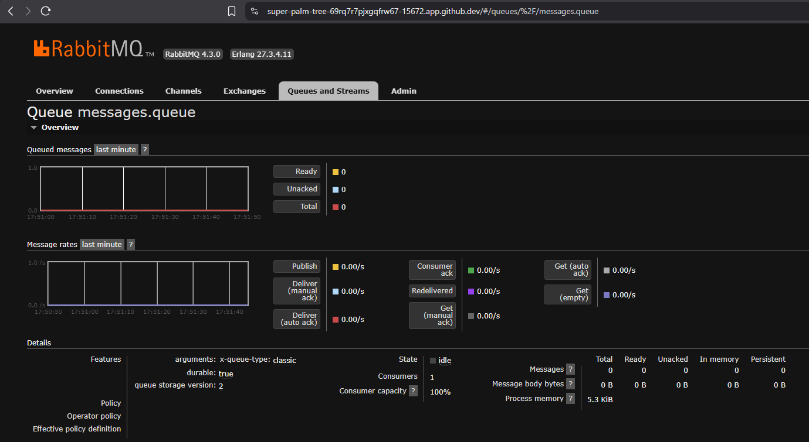

# event-driven-lab
### Juan David Martínez Mendez

## Introducción
Este repositorio contiene una práctica de arquitectura orientada a eventos con Spring Boot y RabbitMQ. Está diseñado como un laboratorio de integración entre dos servicios independientes:

- `producer-service`: produce mensajes desde un endpoint REST y los publica en RabbitMQ.
- `consumer-service`: consume mensajes desde una cola de RabbitMQ y procesa el contenido.

La comunicación entre servicios se realiza mediante un broker AMQP (RabbitMQ) y un patrón producer/consumer.

## Objetivo
El objetivo de la práctica es crear un flujo sencillo de eventos usando Spring AMQP y Docker Compose, demostrando:

- Configuración de un exchange, una cola y un binding en RabbitMQ.
- Envío de mensajes desde un servicio productor mediante un endpoint REST.
- Recepción y procesamiento de mensajes en un servicio consumidor.
- Despliegue local con Docker Compose y uso de contenedores para los servicios y RabbitMQ.

## Estructura del proyecto

```
event-driven-lab/
├── .devcontainer/
├── .git/
├── .gitignore
├── README.md
├── docker-compose.yml
├── producer-service/
│   ├── Dockerfile
│   ├── pom.xml
│   └── src/
│       ├── main/
│       │   ├── java/
│       │   │   └── com/eci/arcn/
│       │   │       ├── ProducerServiceApplication.java
│       │   │       └── producer_service/
│       │   │           ├── config/
│       │   │           │   └── RabbitMQConfig.java
│       │   │           └── controller/
│       │   │               └── MessageController.java
│       │   └── resources/
│       │       └── application.properties
│       └── test/
│           └── java/
│               └── com/eci/arcn/
│                   └── producer_service/
│                       └── ProducerServiceApplicationTests.java
└── consumer-service/
    ├── Dockerfile
    ├── pom.xml
    └── src/
        ├── main/
        │   ├── java/
        │   │   └── com/eci/arcn/
        │   │       ├── ConsumerServiceApplication.java
        │   │       └── consumer_service/
        │   │           ├── config/
        │   │           │   └── RabbitMQConfig.java
        │   │           └── listener/
        │   │               └── MessageListener.java
        │   └── resources/
        │       └── application.properties
        └── test/
            └── java/
                └── com/eci/arcn/
                    └── consumer_service/
                        └── ConsumerServiceApplicationTests.java
```

- `producer-service/`: servicio Spring Boot que expone `POST /api/messages/send` para enviar mensajes.
- `consumer-service/`: servicio Spring Boot que escucha la cola RabbitMQ definida y procesa los mensajes recibidos.
- `docker-compose.yml`: orquesta RabbitMQ, producer y consumer en la misma red.
- `.gitignore`: evita subir artefactos generados como `target/`.

## Configuración clave

### Producer
- `producer-service/src/main/resources/application.properties`
  - `spring.rabbitmq.host=rabbitmq`
  - `spring.rabbitmq.port=5672`
  - `app.rabbitmq.exchange=messages.exchange`
  - `app.rabbitmq.queue=messages.queue`
  - `app.rabbitmq.routingkey=messages.routingkey`
- `producer-service/src/main/java/com/eci/arcn/producer_service/config/RabbitMQConfig.java`
  - Declara la cola, el exchange directo y el binding.
- `producer-service/src/main/java/com/eci/arcn/producer_service/controller/MessageController.java`
  - Exposición del endpoint REST: `/api/messages/send?message=...`.

### Consumer
- `consumer-service/src/main/resources/application.properties`
  - `spring.rabbitmq.host=rabbitmq`
  - `spring.rabbitmq.port=5672`
  - `app.rabbitmq.queue=messages.queue`
- `consumer-service/src/main/java/com/eci/arcn/consumer_service/listener/MessageListener.java`
  - Escucha la cola con `@RabbitListener` y registra el mensaje recibido.
- `consumer-service/src/main/java/com/eci/arcn/consumer_service/config/RabbitMQConfig.java`
  - Declara la cola para asegurar que existe cuando se inicia el consumidor.

## Hallazgos

- El productor depende de la configuración del exchange, la cola y la routing key para publicar mensajes correctamente.
- El consumidor debe usar el mismo nombre de cola (`messages.queue`) para recibir los mensajes.
- `consumer-service` no expone un endpoint HTTP; su función es exclusivamente recibir y procesar eventos de RabbitMQ.
- En Docker Compose, ambos servicios se conectan a RabbitMQ usando el hostname `rabbitmq` dentro de la red `event_network`.
- El `producer-service` expone el puerto `8080`, mientras que el `consumer-service` no necesita exponer un puerto para su funcionalidad principal.
- La práctica está alineada con un enfoque de eventos desacoplados: el productor publica y el consumidor recibe sin llamada directa entre ellos.

A continuación se adjuntan pruebas de los resultados del laboratorio

## Uso

1. Construir los servicios con Maven:
   - `cd producer-service && mvn clean package`
   - `cd ../consumer-service && mvn clean package`
2. Iniciar los contenedores:
   - `docker-compose up --build`
3. Enviar un mensaje desde el productor:
   - `curl -X POST "http://localhost:8080/api/messages/send?message=Hola"`
4. Verificar en los logs del consumidor que el mensaje fue recibido.
5. Acceder a RabbitMQ Management UI en `http://localhost:15672` con credenciales `guest/guest`.

## Consideraciones importantes

- Asegúrate de que los `target/` no se suban al repositorio. El `.gitignore` debe ignorar las carpetas de build en ambos servicios.
- Si ejecutas localmente fuera de Docker, cambia `spring.rabbitmq.host` a `localhost` cuando el broker se use directamente en la máquina local.
- Usa Java 17 y Spring Boot 3.x como base del proyecto.
- La configuración de RabbitMQ es compartida entre ambos servicios; cualquier desalineación en nombres de cola/exchange/routingkey rompe el flujo de eventos.

## Conclusión
Este laboratorio demuestra un patrón básico de integración de microservicios con mensajería. El valor principal está en la separación clara entre productor y consumidor, y en el uso de RabbitMQ como broker para desacoplar la comunicación entre ambos servicios.
